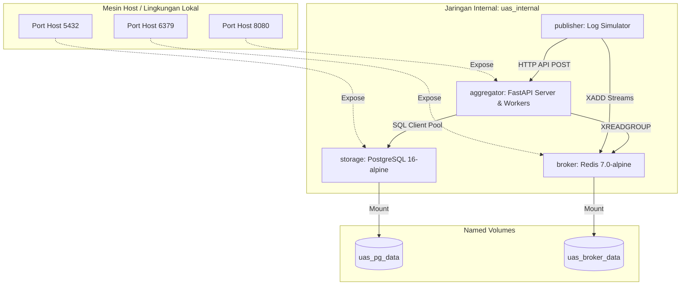

# Pub-Sub Log Aggregator Terdistribusi dengan Idempotent Consumer, Deduplication, dan Transaksi/Kontrol Konkurensi

> **Topik Proyek:** Implementasi Pub-Sub Log Aggregator Terdistribusi dengan Idempotent Consumer, Deduplication, dan Transaksi/Kontrol Konkurensi  
> **Nama:** Imam Dzulvan Muffid  
> **NIM:** 11231031  
> **Teknologi:** Python (FastAPI, Asyncio), PostgreSQL 16, Redis 7 (Streams)  
> **Link Repository:** 
> **Link Video Demo:** https://youtu.be/HFfvibAFUTw

---

## 🛠️ Deskripsi Sistem & Tech Stack

Sistem ini adalah platform pengumpul log terdistribusi (*distributed log aggregator*) berkinerja tinggi yang dirancang untuk menerima, mendeduplikasi, dan menyimpan log event secara durabel. Sistem ini dibangun menggunakan **arsitektur modular bersih** (*clean architecture*) dan diuji secara ketat untuk menjamin konsistensi data di bawah beban konkurensi tinggi tanpa ada risiko pemrosesan ganda (*double-processing*).

### Komponen Utama (Docker Services)
1. **Aggregator (FastAPI & Asyncio)**: API Gateway penerima log event (`POST /publish`) dan penyedia data statistik/audit (`GET /events`, `GET /stats`, `/health`). Menjalankan *background consumers* paralel yang menarik data dari Redis secara asinkron menggunakan Consumer Groups.
2. **Publisher Simulator**: Generator log event asinkron yang melontarkan 20.000 log event dengan 30% duplikasi ke broker Redis Streams dan API HTTP secara paralel.
3. **Broker (Redis 7)**: Broker pesan internal berbasis Redis Streams untuk mendukung pembagian beban kerja (*load balancing*) via Consumer Groups dengan jaminan semantik *at-least-once delivery*.
4. **Storage (PostgreSQL 16)**: Database relasional persisten yang mengontrol keunikan data (`topic`, `event_id`) dan counter statistik secara transaksional dengan isolasi level `READ COMMITTED`.

---

## Arsitektur Jaringan & Volume

Semua layanan diisolasi di dalam jaringan internal bridge Docker Compose tanpa dependensi internet eksternal (*defense in depth*). Data tetap aman meskipun kontainer dimatikan dan dibuat ulang berkat penggunaan *Docker Named Volumes*.



---

## Quick Start

### Prasyarat
* Docker & Docker Compose v2+
* Python 3.11+ (opsional, untuk menjalankan skenario uji secara lokal)

---

### A. Menjalankan Aplikasi & Demo Alur Data (Manual Verification Flow)

Untuk mendemonstrasikan aliran data dari kondisi kosong (`0`) hingga penuh secara *real-time* (seperti dalam skrip demo), ikuti langkah-langkah berikut:

#### 1. Bersihkan Volume Lama
Gunakan perintah ini untuk menghapus seluruh volume kontainer lama agar database dan Redis kembali bersih ke angka nol:
```bash
docker compose down -v
```

#### 2. Jalankan Hanya Infrastruktur & Server Aggregator
Jalankan server FastAPI, database Postgres, dan broker Redis di latar belakang (*detached mode*):
```bash
docker compose up -d storage broker aggregator
```
*Tunggu hingga status healthcheck Postgres dan Redis berubah menjadi **healthy**.*

#### 3. Periksa Status Awal (Stats = 0)
Buka browser Anda dan akses halaman statistik di: **[http://localhost:8080/stats](http://localhost:8080/stats)**  
Anda akan melihat semua counter bernilai nol:
```json
{
  "received": 0,
  "unique_processed": 0,
  "duplicate_dropped": 0,
  "topics": [],
  "uptime_seconds": 12.34
}
```

#### 4. Jalankan Simulator Pengiriman Data
Simulator pengiriman data mendukung tiga mode pengisian (`PUBLISH_MODE`): `redis` saja, `http` saja, atau `both` (default).

Untuk menjalankan demo pengiriman log, jalankan simulator di terminal depan Anda:
```bash
# Untuk menjalankan simulasi penuh secara otomatis (Redis Stream + HTTP POST)
docker compose up publisher
```
*Atau jika ingin menjalankan secara bertahap sesuai skrip demonstrasi:*
```bash
# Kirim 20.000 log event hanya melalui Redis Streams
docker compose run --rm -e PUBLISH_MODE=redis publisher

# Kirim 20.000 log event yang sama hanya melalui HTTP POST API
docker compose run --rm -e PUBLISH_MODE=http publisher
```

#### 5. Periksa Status Akhir (Stats Setelah Deduplikasi)
Kembali ke halaman statistik di **[http://localhost:8080/stats](http://localhost:8080/stats)** dan refresh browser. Hasil akhir setelah simulator selesai berjalan akan mematuhi formula invarian:
$$\text{Received (40.000)} = \text{Unique Processed (14.000)} + \text{Duplicate Dropped (26.000)}$$

---

## Endpoint API Aggregator

API Aggregator berjalan secara lokal di port `8080` dan menyediakan beberapa endpoint operasional:

| Method | Endpoint | Deskripsi | Parameter/Payload | Contoh Respon |
|---|---|---|---|---|
| **POST** | `/publish` | Menerima pengiriman log tunggal atau batch secara konkuren. | Body: Skema JSON `LogEvent` atau list of `LogEvent`. | `{"status": "accepted", "processed_count": 50}` |
| **GET** | `/stats` | Mengembalikan metrik statistik live aggregator log. | - | `{"received": 40000, "unique_processed": 14000, "duplicate_dropped": 26000, "topics": [...]}` |
| **GET** | `/events` | Mengambil seluruh log event unik yang tersimpan di PostgreSQL. | Query: `topic` (filter), `limit` (default: 100), `offset`. | Array of `LogEvent` dari Postgres. |
| **GET** | `/health` | Memeriksa status kesehatan server API, koneksi Redis, dan Postgres. | - | `{"status": "healthy", "database": "connected", "broker": "connected"}` |

---

## Pengujian Sistem (Pytest)

Proyek ini dilengkapi dengan **18 skenario pengujian integrasi** terotomatisasi menggunakan Pytest untuk memverifikasi fungsionalitas logika bisnis, resiliensi deadlock, dan ketahanan data.

### Cara Menjalankan Uji Lokal
1. Pastikan layanan Docker utama sedang aktif (`docker compose up -d`).
2. Instal pustaka pengujian di host lokal Anda:
   ```bash
   pip install -r tests/requirements.txt
   ```
3. Jalankan suite pengujian:
   ```bash
   python -m pytest tests/ -v
   ```

### Ringkasan Cakupan 18 Tes Uji
* **`test_schema.py`**: Memastikan validasi payload JSON dan format ISO-8601 timestamp berjalan dengan benar sesuai standar schema.
* **`test_api.py`**: Memverifikasi routing API `POST /publish` untuk single dan batch event, serta query pencarian di `GET /events`.
* **`test_dedup.py`**: Menguji presisi penyaringan duplikat. Event dengan ID dan Topik yang sama wajib dibuang, sedangkan ID sama dengan Topik berbeda dianggap unik.
* **`test_stats.py`**: Memastikan invarian statistik `received == unique + duplicate` tidak pernah bocor.
* **`test_persistence.py`**: Membuktikan ketahanan data pasca-crash (*persistence test*) dengan menghentikan container database dan menyalakannya kembali tanpa kehilangan data historis.
* **`test_concurrency.py`**: Melakukan simulasi beban puncak konkurensi tinggi (20 task paralel simultan) untuk menguji penanganan *Deadlock* database dan membuktikan tidak adanya kebocoran data (*double-processing*).
