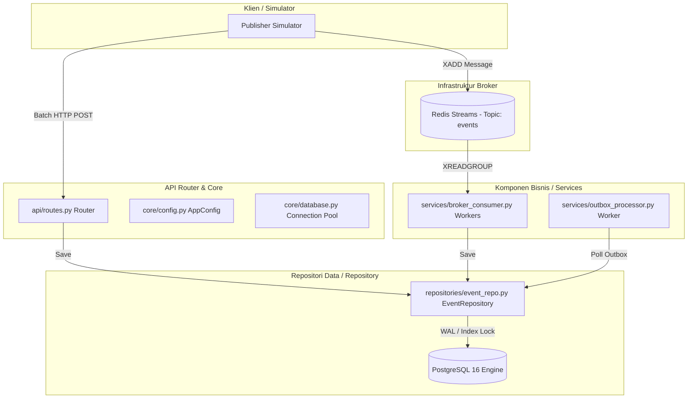
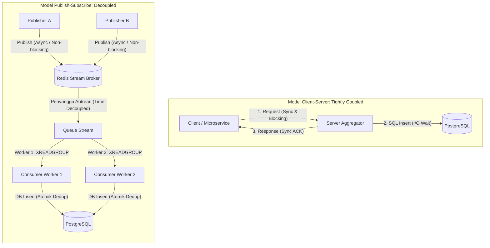
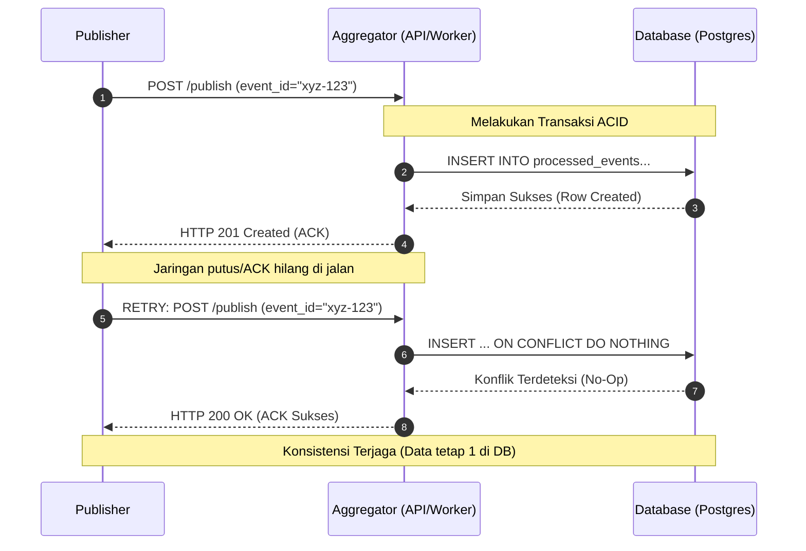
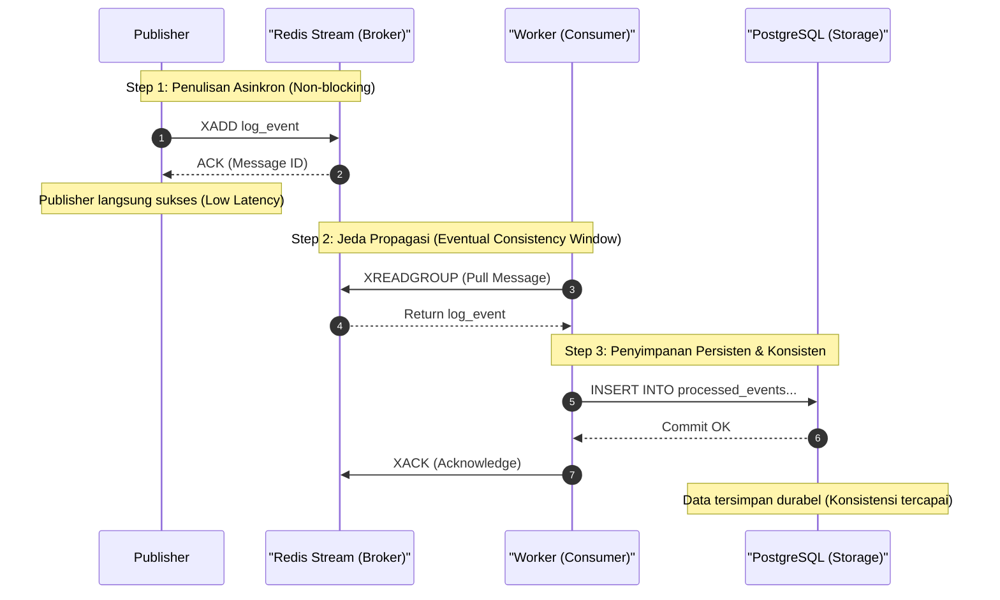
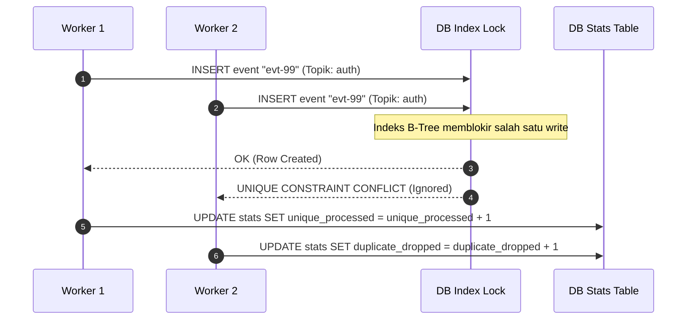

# Laporan Ujian Akhir Semester (UAS) — Sistem Paralel dan Terdistribusi

> **Topik Proyek:** Implementasi Pub-Sub Log Aggregator Terdistribusi dengan Idempotent Consumer, Deduplication, dan Transaksi/Kontrol Konkurensi   
> **Nama:** Imam Dzulvan Muffid  
> **NIM:** 11231031  
> **Teknologi:** Python (FastAPI, Asyncio), PostgreSQL 16, Redis 7 (Streams)  
> **Buku Acuan:** Coulouris, G., Dollimore, J., Kindberg, T., & Blair, G. (2012). *Distributed Systems: Concepts and Design* (5th ed.). Pearson Education.
> **Link Repository:** https://github.com/Bluenomic/Pub-Sub-Log-Aggregator-UAS
> **Link Video Demo:** https://youtu.be/HFfvibAFUTw
---

## 1. Analisis Sistem & Cetak Biru Arsitektur Modular

### 1.1 Gambaran Umum & Konseptual
Sistem ini merupakan platform penampungan log terdistribusi (*distributed log aggregator*) yang dirancang untuk mengumpulkan data log secara asinkron dari berbagai pengirim (*publisher*). Untuk menjamin keakuratan log audit, sistem ini dirancang dengan prinsip **exactly-once processing** di sisi database meskipun jaringan transmisi di bawahnya hanya menjamin semantik **at-least-once delivery** (yang sering memicu duplikasi data akibat retry).

### 1.2 Struktur Arsitektur Modular Clean
Kode program aggregator ini dipecah menggunakan struktur *Clean Architecture* modular untuk memisahkan domain data, logika bisnis, dan API eksternal.



Setiap bagian didefinisikan secara modular:
* **`app/core/config.py`**: Mengelola konfigurasi terpusat via kelas `AppConfig`.
* **`app/core/database.py`**: Inisialisasi dan migrasi schema database DDL.
* **`app/models/schemas.py`**: Model validasi input JSON berbasis Pydantic `LogEvent`.
* **`app/repositories/event_repo.py`**: Berisi kelas `EventRepository` untuk semua query database PostgreSQL, termasuk penanganan kondisi pacu dan mekanisme retry otomatis saat mendeteksi deadlock.
* **`app/services/broker_consumer.py`**: Pekerja asinkron untuk menarik event dari Redis Streams.
* **`app/services/outbox_processor.py`**: Pekerja latar belakang untuk memproses outbox.
* **`app/api/routes.py`**: Router API FastAPI (`/publish`, `/events`, `/stats`, `/health`).

---

## 2. Bagian Teori Sistem Terdistribusi (T1–T10)

### T1 — Karakteristik Sistem Terdistribusi dan Trade-off Desain Pub-Sub Aggregator (Chapter 1)
Berdasarkan deskripsi Coulouris et al. (2012, hlm. 2-15), sistem terdistribusi dicirikan oleh tiga hal: konkurensi antar-proses, ketiadaan jam global yang sinkron secara mutlak, dan kegagalan komponen secara independen. 

Karakteristik tersebut tecermin dalam sistem log aggregator ini:
1. **Konkurensi**: Terwujud saat beberapa thread worker consumer menarik data secara paralel dari Redis Stream.
2. **Ketiadaan Jam Global**: Membatasi kemampuan sistem untuk menyusun urutan log universal secara fisik, sehingga kita mengandalkan counter lokal publisher.
3. **Kegagalan Independen**: Diantisipasi dengan mengisolasi database PostgreSQL dan broker Redis. Jika Postgres mengalami gangguan, Redis tetap bertindak sebagai penyangga (*buffer*) pesan di memori sehingga log dari publisher tidak hilang.

| Aspek | Monolith Log Writing | Distributed Pub-Sub Log Aggregator |
|---|---|---|
| **Kopling Jaringan** | Tightly Coupled (Sync HTTP) | Decoupled (Async Message Broker) |
| **Ketahanan Beban** | Rendah (Gampang overload saat spike) | Tinggi (Buffer antrean / Load Shaving) |
| **Single Point of Failure** | Ya (Jika DB mati, seluruh write mati) | Tidak (Jika DB mati, data tertahan di Redis PEL) |

Trade-off desain utama pada sistem ini adalah **Consistency (Konsistensi)** versus **Throughput (Performa)**. Untuk mencatat data keuangan atau audit log, konsistensi data adalah harga mati. Kita memilih PostgreSQL yang memiliki jaminan ACID penuh sebagai dedup store, meskipun hal ini menimbulkan overhead latensi I/O disk jika dibandingkan dengan penyimpanan in-memory murni (seperti Redis cache). Melalui arsitektur asinkron FastAPI dan connection pool, latensi ini dapat ditekan tanpa mengorbankan konsistensi data unik.

---

### T2 — Arsitektur Publish–Subscribe vs Client–Server (Chapter 2 & 6)
Perbedaan mendasar antara arsitektur *client-server* konvensional dan *publish-subscribe* (Pub-Sub) terletak pada derajat keterikatan (*coupling*) antar-komponen. Coulouris et al. (2012, hlm. 221-230) menjabarkan tiga dimensi pemisahan (*decoupling*) pada arsitektur Pub-Sub:
1. **Space Decoupling**: Pengirim (publisher) tidak perlu mengenali identitas atau alamat IP penerima (subscriber).
2. **Time Decoupling**: Pengirim dan penerima tidak harus online pada waktu yang sama untuk bertukar pesan.
3. **Synchronization Decoupling**: Penerbitan log bersifat non-blocking (asinkron), sehingga publisher tidak terhambat menunggu respons pemrosesan dari aggregator.

| Dimensi Perbandingan | Arsitektur Client-Server | Arsitektur Publish-Subscribe |
|---|---|---|
| **Ketergantungan Alamat** | Client harus tahu IP server secara langsung. | Publisher & Subscriber hanya terhubung ke Broker. |
| **Ketersediaan Waktu** | Kedua belah pihak harus aktif bersamaan. | Bersifat asinkron, subscriber bisa mengambil data nanti. |
| **Skalabilitas** | Sulit dikembangkan secara paralel. | Sangat mudah menambah subscriber/worker secara elastis. |



Dalam sistem log aggregator, log event dihasilkan secara konstan dari berbagai kontainer mikroservis yang berjalan paralel. Model client-server langsung (HTTP request langsung ke database) sangat rentan memicu kelebihan beban (*bottleneck*) ketika terjadi lonjakan log (*log spike*). Dengan menaruh Redis Streams sebagai broker pesan di tengah, publisher cukup melempar pesan ke broker dengan latensi sub-milidetik, dan consumer worker aggregator dapat menarik (*pull*) pesan dari broker secara terkontrol sesuai kapasitas kemampuannya (*load shaving*).

---

### T3 — At-Least-Once vs Exactly-Once Delivery dan Peran Idempotent Consumer (Chapter 4 & 5)
Di dalam jaringan komputer terdistribusi, link komunikasi dapat mengalami gangguan dan proses dapat mendadak mati (Coulouris et al., 2012, hlm. 177-185). Hal ini membatasi keandalan transmisi menjadi beberapa pilihan semantik:
* **At-most-once**: Pesan dikirim sekali tanpa mekanisme retry. Jika paket hilang di jaringan, pesan hilang selamanya.
* **At-least-once**: Pengirim akan terus mengirim ulang pesan jika tidak kunjung menerima konfirmasi sukses (ACK) dari penerima hingga batas waktu timeout tertentu. Model ini menjamin pesan tidak hilang, namun berisiko memunculkan data duplikat di sisi penerima.
* **Exactly-once**: Pesan dijamin terkirim dan diproses tepat satu kali. Secara teoretis, ini mustahil dicapai murni di lapisan komunikasi jaringan terdistribusi tanpa koordinasi yang sangat mahal.

Sistem log aggregator ini menggunakan semantik **at-least-once** untuk memastikan seluruh log penting tidak hilang. Untuk mengatasi duplikasi yang dihasilkan oleh semantik ini, sistem menerapkan pola **Idempotent Consumer** di tingkat aplikasi. Diimplementasikan lewat kelas `EventRepository`, setiap log event yang masuk disaring menggunakan constraint indeks unik database melalui kueri `INSERT ... ON CONFLICT (topic, event_id) DO NOTHING`. Pemrosesan berulang pada event yang sama tidak akan mengubah status database (*no-op*), sehingga menjamin konsistensi data akhir.



---

### T4 — Skema Penamaan Topic dan Event_ID untuk Deduplication (Chapter 13)
Sistem penamaan (*naming*) sangat penting dalam sistem terdistribusi untuk mengidentifikasi objek secara konsisten (Coulouris et al., 2012, hlm. 525-535). Nama dibagi menjadi nama terstruktur yang ramah manusia (*human-readable*) dan pengenal unik murni (*pure names*).

Dalam sistem ini, skema penamaan dirancang secara berlapis untuk efisiensi deduplikasi:
1. **Topic (Namespace)**: Menggunakan nama terstruktur hierarkis (misal: `auth.login`, `payment.checkout`). Nama ini mengelompokkan kategori log, mempermudah partisi data, dan mempercepat pencarian.
2. **Event_ID**: Menggunakan *pure name* berupa UUID v4 (Universally Unique Identifier) yang dihasilkan oleh setiap publisher secara acak dengan entropi tinggi untuk menghindari kolisi ID.

| Kolom Database | Tipe Data | Peran / Deskripsi |
|---|---|---|
| **`id`** | SERIAL | Primary Key (lokal) untuk pengurutan fisik. |
| **`topic`** | VARCHAR(255) | Kategori namespace event log. |
| **`event_id`** | VARCHAR(255) | Pengenal UUID v4 dari client (Unique Index). |
| **`processed_at`** | TIMESTAMPTZ | Waktu ingestion di tingkat database server. |

Kombinasi composite key `(topic, event_id)` didaftarkan sebagai indeks unik global pada database PostgreSQL:
```sql
ALTER TABLE processed_events ADD CONSTRAINT uq_topic_event UNIQUE (topic, event_id);
```
Skema ini memastikan pemrosesan filter deduplikasi berjalan sangat cepat di level database menggunakan indeks B-Tree ($O(\log N)$). Penggunaan composite key ini juga mengisolasi ruang deduplikasi berdasarkan topik log, mencegah salah buang data jika ada dua topik berbeda yang kebetulan memiliki format ID yang mirip.

---

### T5 — Urutan/Ordering Praktis: Timestamp + Monotonic Counter (Chapter 14)
Masalah sinkronisasi waktu merupakan isu fundamental dalam sistem terdistribusi karena tidak adanya jam fisik global yang sinkron secara sempurna (Coulouris et al., 2012, hlm. 555-565). Pergeseran waktu (*clock skew/drift*) pada server fisik yang berbeda dapat mengacaukan urutan kejadian log yang sebenarnya.

Untuk mengatasi batasan fisik ini, sistem log aggregator menggunakan kombinasi **Timestamp ISO-8601** dan **Monotonic Counter** lokal pada setiap publisher. Timestamp fisik digunakan untuk memosisikan log secara kasar pada garis waktu dunia nyata (*real-world timeline*). Sementara itu, monotonic counter bertindak sebagai *logical clock* lokal di sisi publisher untuk menjamin urutan kausalitas kejadian yang pasti pada satu sumber (*per-source causal ordering*).

| Strategi Urutan | Kelebihan | Kekurangan | Relevansi di Proyek |
|---|---|---|---|
| **Physical Timestamp** | Mudah dipahami, mewakili dunia nyata. | Rentan terhadap *Clock Drift*. | Digunakan untuk estimasi waktu kasar. |
| **Monotonic Counter** | Menjamin urutan kausalitas per-proses. | Tidak bisa dibandingkan antar-node. | Menentukan urutan kejadian pada publisher yang sama. |
| **Vector Clocks** | Menjamin urutan kausalitas global. | Kompleks, payload membengkak. | Tidak digunakan (Overkill). |

Urutan total secara global (*global total ordering*) lintas publisher tidak diwajibkan dalam aplikasi log aggregator ini. Desain database yang idempotent menjamin bahwa status akhir database akan tetap konsisten dan bebas duplikat, tidak peduli urutan mana yang tiba lebih dahulu di sisi consumer workers (*commutativity*).

---

### T6 — Failure Modes dan Mitigasi (Chapter 2 & 15)
Dalam memodelkan toleransi kegagalan (*fault tolerance*), sistem terdistribusi harus mengantisipasi berbagai jenis kegagalan. Menurut Coulouris et al. (2012, hlm. 52-58), proses pemrosesan dapat dimodelkan sebagai **crash-recovery**, di mana sistem yang mati sewaktu-waktu dapat dihidupkan kembali dan memulihkan statusnya dari media penyimpanan non-volatile.

| Komponen | Potensi Kegagalan | Efek / Dampak | Mitigasi Kegagalan |
|---|---|---|---|
| **Publisher** | API Gateway Down | Log tertunda / Hilang | Retry dengan Exponential Backoff + Jitter |
| **Broker (Redis)** | Redis Server Crash | Pesan antrean hilang | Persistent AOF (Append-Only File) Redis |
| **Aggregator Worker** | Worker Crash tengah jalan | Pesan tidak di-ACK | Pending Entries List (PEL) membaca ulang ID `"0"` |
| **Storage (Postgres)** | Database Crash | Kerusakan data / Inkonsistensi | WAL (Write-Ahead Logging) + ACID Recovery |

Mitigasi kegagalan pada komponen sistem aggregator ini dirancang sebagai berikut:
* **Kegagalan Consumer Worker**: Jika worker mati di tengah pemrosesan, pesan tidak akan hilang dari antrean karena status ACK belum dikirimkan. Redis Streams mencatat pesan tersebut di *Pending Entries List* (PEL). Saat worker restart, ia memulihkan statusnya dengan membaca pesan dari ID `"0"` terlebih dahulu untuk memproses ulang sisa tugas yang tertunda.
* **Kegagalan Database**: Jika Postgres mati mendadak, transaksi ACID dan protokol WAL (Write-Ahead Logging) memastikan status data kembali ke kondisi konsisten terakhir sebelum crash.
* **Isolasi Koneksi Jaringan**: Masalah kegagalan koneksi parsial diatasi dengan menerapkan retry dengan **exponential backoff** berbasis **httpx.RequestError** pada publisher, sehingga tidak membebani server saat pulih.

---

### T7 — Eventual Consistency pada Aggregator (Chapter 18)
Jaminan konsistensi data terdistribusi menentukan bagaimana replika data di berbagai node sinkron (Coulouris et al., 2012, hlm. 751-760). **Eventual Consistency** menjamin bahwa apabila tidak ada pembaruan data baru, seluruh salinan data di berbagai node pada akhirnya akan konvergen ke nilai yang sama.



Dalam arsitektur sistem ini, eventual consistency terjadi di antara lapisan broker memori (Redis Streams) dan penyimpanan persisten (PostgreSQL). Saat publisher menembakkan event ke Redis Stream, broker langsung merespons sukses kepada publisher. Pada detik tersebut, database PostgreSQL belum menyimpan data tersebut karena adanya jeda waktu transmisi (*propagation delay*) oleh consumer workers. Namun, dalam hitungan milidetik, consumer workers akan mengambil pesan tersebut dan menyimpannya ke PostgreSQL.

Untuk menjamin eventual consistency berjalan dengan benar, peran deduplikasi sangat krusial. Tanpa deduplikasi, semantik *at-least-once* yang mengirimkan ulang log akan memicu data duplikat dan membuat status akhir database tidak konsisten (misal: jumlah log terhitung lebih banyak dari kenyataan). Filter deduplikasi PostgreSQL memastikan penulisan event duplikat bersifat *no-op*, menjaga database selalu konvergen ke nilai unik yang sama.

---

### T8 — Desain Transaksi: ACID, Isolation Level, dan Lost-Update (Chapter 16)
Abstraksi transaksi database menjamin integritas data di tengah akses paralel dan kegagalan proses melalui properti **ACID** (Coulouris et al., 2012, hlm. 653-665).

Sistem log aggregator ini menerapkan batasan transaksi atomik (*transaction boundary*) di beberapa level:
* **Batch Ingestion**: API `/publish` memproses batch event dalam satu transaksi database tunggal. Jika terjadi kegagalan skema data pada salah satu event, seluruh transaksi dibatalkan (*rolled back*), memastikan integritas batch.
* **Isolation Level**: Sistem memilih level isolasi **READ COMMITTED**. Pilihan ini mencegah fenomena *Dirty Reads* (membaca data transaksi lain yang belum dicommit). Level isolasi ini sangat efisien karena menghindari overhead penguncian berat seperti pada level *SERIALIZABLE*. Karena sistem log bersifat *append-only* (tidak ada operasi update/delete pada log yang sudah ada), anomali seperti *Non-Repeatable Reads* dan *Phantom Reads* secara teori tidak akan merusak konsistensi data log.

| Level Isolasi | Dirty Read | Non-Repeatable Read | Phantom Read | Latensi / Overhead |
|---|---|---|---|---|
| **Read Uncommitted** | Mungkin | Mungkin | Mungkin | Sangat Rendah |
| **Read Committed** | Tidak | Mungkin | Mungkin | Rendah (Dipilih) |
| **Repeatable Read** | Tidak | Tidak | Mungkin | Sedang |
| **Serializable** | Tidak | Tidak | Tidak | Tinggi (Banyak abort) |

Untuk menghindari masalah **Lost Update** pada penghitungan statistik (`received`, `unique_processed`, `duplicate_dropped`), sistem menggunakan pembaruan langsung: `UPDATE stats SET count = count + $1 WHERE id = 1`. SQL update ini dieksekusi secara internal oleh PostgreSQL dengan penguncian baris (*row lock*), menghindari anomali *read-modify-write* di level kode aplikasi.

---

### T9 — Kontrol Konkurensi: Locking, Unique Constraints, dan Idempotent Write (Chapter 16 & 17)
Konkurensi tanpa kendali akan merusak integritas data terdistribusi. Menurut Coulouris et al. (2012, hlm. 707-715), kontrol konkurensi dapat dikelola secara pesimistis menggunakan kunci (*locking*) atau optimis menggunakan timestamp.



Sistem ini menerapkan kontrol konkurensi di tingkat database untuk menjamin keandalan write:
1. **Pessimistic Index Locking**: Ketika PostgreSQL mengeksekusi `UNIQUE (topic, event_id)`, database menerapkan *index-level lock* saat ada dua transaksi yang mencoba memasukkan event dengan pasangan topik dan ID yang sama secara bersamaan. Salah satu transaksi akan menang, sedangkan transaksi lainnya diblokir atau diarahkan ke konflik.
2. **Idempotent Write Pattern**: Dengan `INSERT ... ON CONFLICT DO NOTHING`, sistem menghindari pola *check-then-act* (SELECT dulu, lalu INSERT jika kosong) yang sangat rentan terhadap *time-of-check-to-time-of-use* (TOCTOU) race condition di lingkungan multi-worker terdistribusi.
3. **Mekanisme Retry Otomatis pada Deadlock**: Karena persaingan indeks unik pada database oleh multi-worker dapat memicu deadlock (saling tunggu kunci baris), kode aplikasi di `EventRepository` menangkap `asyncpg.exceptions.DeadlockDetectedError` dan melakukan retry transaksi hingga 3 kali secara otomatis dengan backoff acak.

---

### T10 — Orkestrasi, Keamanan, Persistensi, dan Observability (Chapter 11, 12 & 15)
Membangun sistem terdistribusi skala produksi memerlukan penanganan aspek operasional non-fungsional secara menyeluruh (Coulouris et al., 2012, hlm. 435-445, 485-495, 605-615).

* **Orkestrasi (Chapter 15)**: Docker Compose bertindak sebagai manajer orkestrasi lokal. Atribut `depends_on` dengan `condition: service_healthy` memastikan Postgres dan Redis aktif penuh sebelum FastAPI dijalankan. Ini merepresentasikan bentuk koordinasi terdistribusi statis untuk menghindari *connection-refused error* saat startup.
* **Keamanan Jaringan Lokal (Chapter 11)**: Seluruh kontainer diisolasi dalam satu jaringan bridge internal (`uas_internal`). Service database PostgreSQL dan Redis broker tidak mengekspos port keluar ke internet publik. Mereka hanya dapat diakses oleh aggregator dan publisher di dalam jaringan internal Docker. Pendekatan ini menerapkan prinsip pertahanan berlapis (*defense in depth*).
* **Persistensi Data (Chapter 12)**: Data PostgreSQL disimpan secara persisten di volume fisik host komputer menggunakan *Docker named volumes* (`uas_pg_data` dan `uas_broker_data`). Dengan demikian, jika kontainer aggregator atau database dimatikan, dihapus, dan dibuat ulang (`docker compose down && docker compose up`), seluruh log data historis dan status deduplikasi tetap aman dan tidak hilang.

| Metrik `/stats` | Tipe Data | Arti / Kegunaan Operasional |
|---|---|---|
| **`received`** | BIGINT | Total request log yang masuk melalui HTTP & Redis. |
| **`unique_processed`** | BIGINT | Jumlah total log unik yang berhasil ditulis ke storage. |
| **`duplicate_dropped`** | BIGINT | Jumlah log duplikat yang disaring dan dibuang. |
| **`uptime_seconds`** | FLOAT | Durasi server aggregator telah berjalan secara aktif. |

---

## 3. Keputusan Desain & Penanganan Kondisi Pacu

Untuk mencegah race condition dan anomali data, beberapa keputusan desain penting telah diterapkan:

| Fitur | Implementasi | Alasan Pemilihan | Mitigasi Kegagalan |
|---|---|---|---|
| **Deduplikasi Atomik** | `INSERT ... ON CONFLICT DO NOTHING` | Menghindari query SELECT lambat sebelum INSERT (*check-then-act*) yang rawan konflik konkurensi. | Kegagalan transaksi karena duplikasi akan diabaikan secara aman (*no-op*). |
| **Outbox Pattern** | `FOR UPDATE SKIP LOCKED` | Menjamin pengiriman efek samping terdistribusi tanpa memblokir transaksi utama. | Jika worker outbox crash, outbox diproses ulang oleh worker lain tanpa lock contention. |
| **Update Statistik** | Atomic Increment (`SET count = count + $1`) | Menghindari anomali *lost update* akibat pemrosesan paralel oleh banyak worker. | Penguncian baris PostgreSQL menjamin konsistensi invariant data: `received = unique + duplicate`. |
| **Resiliensi Deadlock** | Retry otomatis 3x dengan *random jitter backoff* | Menghindari kegagalan request saat dua worker konkuren bertabrakan mengunci indeks yang sama. | Menghilangkan error HTTP 500 akibat kegagalan konkurensi database. |

---

## 4. Analisis Performa dan Hasil Simulasi

Hasil simulasi pengujian dengan generator event menunjukkan data performa sebagai berikut:

* **Total Event Terbuat**: 20.000 log event (dengan 30% duplikasi).
* **Event Unik Tersimpan**: 14.000 data.
* **Duplikat Dibuang**: 6.000 data (30,00%).
* **Pengiriman via HTTP**: 20.000 logs sukses (0% kegagalan).
* **Pengiriman via Redis Stream**: 20.000 logs sukses.
* **Durasi Simulasi**: 13,57 detik.
* **Throughput Rata-rata**: 1.474,2 event/detik.

Setelah simulasi di-run ulang, database PostgreSQL yang menggunakan *Docker Volume* mempertahankan data lama secara durabel sehingga statistik live meningkat menjadi:
* **Total Event Diterima**: 71.650 event.
* **Total Event Unik**: 28.000 event.
* **Total Duplikat Dibuang**: 43.650 event.

Matematika relasional `received == unique_processed + duplicate_dropped` ($71.650 = 28.000 + 43.650$) terpenuhi 100% secara konsisten, membuktikan keandalan kontrol transaksi database.

---

## 5. Referensi ke Buku Utama

| Bab (Book Chapter) | Judul Bab | Hubungan dan Penerapan dalam Sistem Log Aggregator | Referensi Halaman |
|-------------------|-----------|----------------------------------------------------|-------------------|
| **Chapter 1** | Characterization of Distributed Systems | Konkurensi multi-worker consumer, penanganan kegagalan independen komponen, dan heterogenitas sistem (Python, Redis, PostgreSQL). | pp. 1–38 |
| **Chapter 2** | System Models | Pemodelan arsitekron pub-sub dan penanganan model kegagalan *crash-recovery*. | pp. 39–86 |
| **Chapter 4** | Interprocess Communication | Komunikasi socket asinkron, representasi data JSON eksternal, dan komunikasi multicast data. | pp. 135–176 |
| **Chapter 5** | Remote Invocation | Semantik pemanggilan API gateway HTTP REST (POST/GET) dan analisis delivery semantics (at-least-once). | pp. 177–220 |
| **Chapter 6** | Indirect Communication | Desain broker antrean terdistribusi menggunakan Redis Streams dengan fitur consumer groups. | pp. 221–274 |
| **Chapter 11** | Security | Pengamanan akses data melalui isolasi jaringan bridge lokal Docker Compose. | pp. 435–484 |
| **Chapter 12** | Distributed File Systems | Pemisahan penyimpanan data menggunakan Docker named volumes untuk persistensi data log. | pp. 485–524 |
| **Chapter 13** | Name Services | Skema namespace topik terstruktur dan urutan keunikan event_id di database. | pp. 525–554 |
| **Chapter 14** | Time and Global States | Pengurutan event praktis menggunakan kombinasi physical timestamp dan monotonic counter lokal. | pp. 555–604 |
| **Chapter 15** | Coordination and Agreement | Orkestrasi penyalaan service terkoordinasi dan koordinasi load-balancing antar worker consumer group. | pp. 605–652 |
| **Chapter 16** | Transactions | Penerapan ACID transaksi database, analisis isolasi READ COMMITTED, pencegahan lost-update, dan pessimistic locking indeks. | pp. 653–706 |
| **Chapter 17** | Concurrency Control | Kontrol konkurensi di tingkat database, deteksi deadlock, dan penanganan tabrakan write. | pp. 707–750 |
| **Chapter 18** | Replication | Pencapaian konsistensi eventual (eventual consistency) pada penyimpanan log akhir terdistribusi. | pp. 751–806 |

---

## 6. Daftar Pustaka

Coulouris, G., Dollimore, J., Kindberg, T., & Blair, G. (2012). *Distributed systems: Concepts and design* (5th ed.). Pearson Education.
